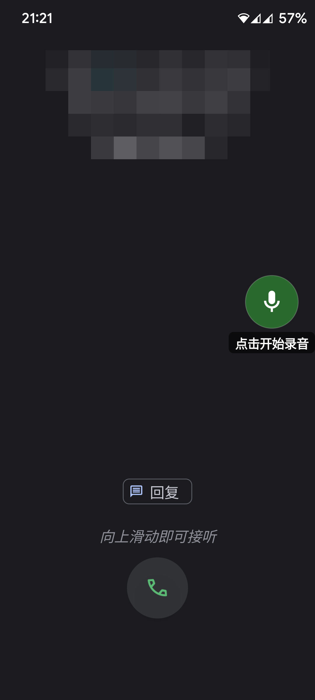
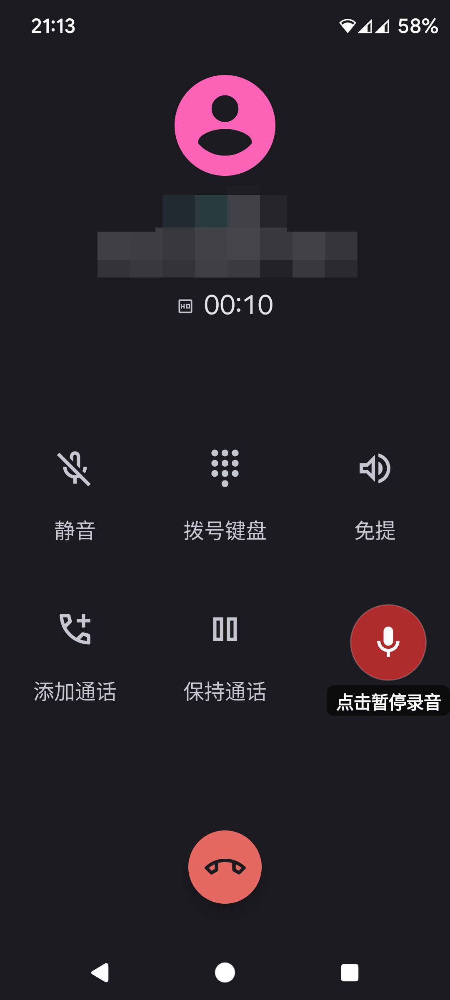
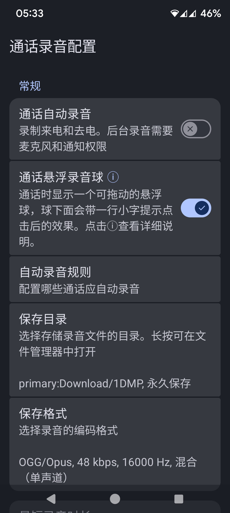
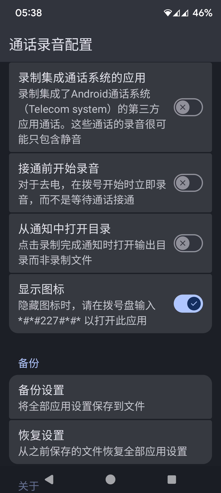

# Basic Call Recorder

[English](README.md) | [中文](README.zh-CN.md)

> **说明**：本仓库 fork 自 [chenxiaolong/BCR](https://github.com/chenxiaolong/BCR)，基于其源码修改，
> 新增了「来电界面录音按钮」功能，方便锁屏状态下无法下拉通知栏时快速开始/暂停录音。
> 新增了「备份和恢复设置」功能，方便刷机/换新机后快速导入设置。
> 本次修改日期：2026-09。
> 与原作者无关，问题反馈请提到 [本仓库 Issues](https://github.com/aksb/BCR/issues)。
> 如果你觉得本修改对你有用，欢迎在页面底部的二维码打赏（仅针对本修改项目，与原作者无关）。

 

本修改项目为纯 AI 编写，未经人工逐行代码审查。本修改模块仅在作者本人刷入 PixelExperience Android 13 系统的红米 K40S 和红米 K30 5G 设备上测试成功，不保证在其他设备、系统版本或环境下的兼容性与稳定性。
刷入模块存在极高风险，可能导致设备出现无限重启、卡屏死机、系统损坏（变砖）乃至硬件受损。在尝试刷入前，请务必提前备份好个人所有重要数据。
如果您缺乏刷机救砖经验，或不知道如何在系统崩溃时进行自救，请绝对不要尝试刷入。
一旦您选择刷入本模块，即视为您已完全理解并自愿接受上述所有风险，由此产生的数据丢失、设备损坏等一切后果均由您本人自行承担。

---

BCR 是一款面向已 root 设备或刷入自定义固件设备的简易 Android 通话录音应用。启用后，它会在后台自动录制来电和去电，平时不打扰使用。

 

## 功能特性

* 支持 Android 9 及更新版本
* 支持多种输出格式：
  * OGG/Opus —— 有损压缩，文件更小，Android 10+ 默认格式
  * M4A/AAC —— 有损压缩，文件更小，Android 9 默认格式
  * FLAC —— 无损，文件较大
  * WAV/PCM —— 无损，文件最大，CPU 占用最低
  * AMR-WB/AMR-NB —— 有损压缩，文件最小，仅支持单声道
* 支持立体声录音（上行、下行声道分离）
  * 注意：目前仅在运行较新版本 Android 的 Pixel 设备上确认可用。其他设备可能出现异常表现，例如上下行声道无法分离，甚至完全没有声音。建议正式依赖此功能前先录一段测试通话确认效果。
* 支持 Android 存储访问框架（Storage Access Framework），可录制到 SD 卡、U 盘等外部存储
* 支持直接启动模式（Direct Boot，重启后首次解锁前也能录音）
* 支持自动录音规则
* 支持快捷设置开关
* 仅在录音进行中才会显示常驻通知
* 不申请任何网络访问权限
* 同时支持 Magisk 和 KernelSU

## 不会做的事

正如项目名称所暗示的，BCR 力求保持尽可能"基础"。如果这个项目最终只需要为了兼容新版 Android 而更新，那就算是达成了目标。因此，很多"可能有用"的功能不会被加入，例如：

* 对旧版 Android 的支持（一旦维护成本变高，相关支持会被直接砍掉）
* 针对[各厂商特有的电量优化 / 应用后台查杀机制](https://dontkillmyapp.com/)的规避方案
* 针对不支持 [`VOICE_CALL` 录音源](https://developer.android.com/reference/android/media/MediaRecorder.AudioSource#VOICE_CALL)设备的规避方案（例如改用麦克风 + 免提通话录音）
* 对未 root 的原厂固件的支持

## 许可证

本项目基于原项目遵循的 GPL-3.0-only 协议开源发布，完整协议文本见仓库内 [`LICENSE`](./LICENSE) 文件。

---

## 打赏（仅针对本修改版）

本 fork 新增了上面提到的来电界面录音按钮功能。如果这个修改对你有帮助，欢迎通过下面的二维码请我喝杯咖啡，这个打赏仅针对本修改项目，与原作者无关。

---

如需下载本修改版（含来电界面录音按钮），请前往[本仓库 Releases 页面](https://github.com/aksb/BCR/releases)。

**关于签名**：本仓库发布的安装包使用固定的自签名调试证书签名，只用来保证本仓库自己发布的各个版本之间可以正常覆盖升级，与原作者的正式签名完全无关。如果你用的是本仓库的包，不需要也不应该按原作者页面的方法去验证签名（那是验证原作者官方包用的，对本仓库的文件不适用）。

其余通用安装步骤、权限说明、录音原理、文件名模板、编译方法等背景内容，请到[原作者发布页面](https://github.com/chenxiaolong/BCR)阅读（注意：原作者页面里的"下载"和"签名验证"部分针对的是原作者官方包，不适用于本仓库）。
